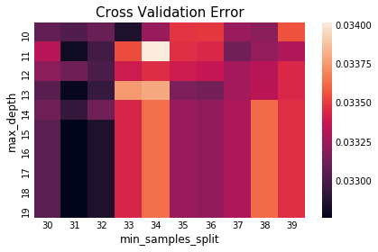
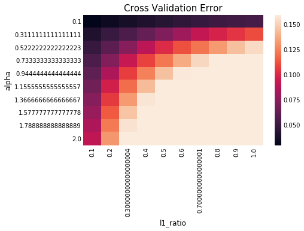
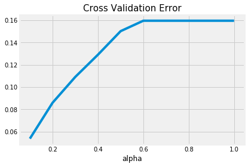
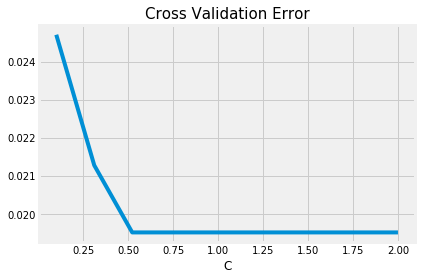
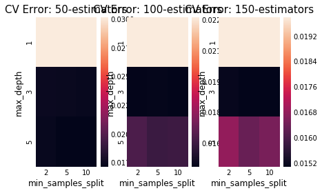
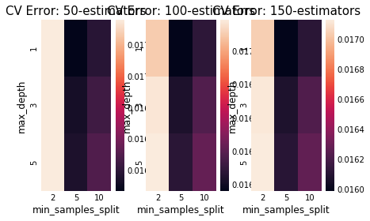
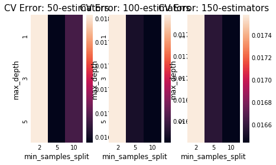
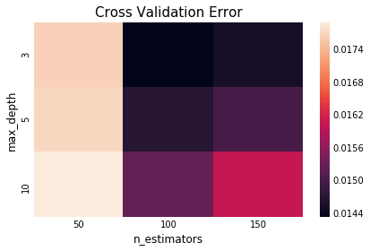

```python
import numpy as np
import pandas as pd
import matplotlib.pyplot as plt
import seaborn as sns
import scipy.stats as st
%matplotlib inline
plt.style.use('fivethirtyeight')
```


```python
# Load data
print('Load data')
TrainData= pd.read_csv('train_clean.csv')
TrainData.head()
```

    Load data


<div>
<style scoped>
    .dataframe tbody tr th:only-of-type {
        vertical-align: middle;
    }

    .dataframe tbody tr th {
        vertical-align: top;
    }

    .dataframe thead th {
        text-align: right;
    }
</style>
<table border="1" class="dataframe">
  <thead>
    <tr style="text-align: right;">
      <th></th>
      <th>1stFlrSF</th>
      <th>2ndFlrSF</th>
      <th>Alley</th>
      <th>BsmtCond</th>
      <th>BsmtExposure</th>
      <th>BsmtFinSF1</th>
      <th>BsmtFinType1</th>
      <th>BsmtFullBath</th>
      <th>BsmtQual</th>
      <th>BsmtUnfSF</th>
      <th>...</th>
      <th>MSZoning_C (all)</th>
      <th>MSZoning_RL</th>
      <th>Neighborhood_ClearCr</th>
      <th>Neighborhood_Crawfor</th>
      <th>Neighborhood_Edwards</th>
      <th>Neighborhood_StoneBr</th>
      <th>SaleCondition_Abnorml</th>
      <th>SaleCondition_Family</th>
      <th>SaleType_New</th>
      <th>SalePrice</th>
    </tr>
  </thead>
  <tbody>
    <tr>
      <th>0</th>
      <td>11.692623</td>
      <td>11.686189</td>
      <td>0.730463</td>
      <td>1.820334</td>
      <td>1.540963</td>
      <td>11.170327</td>
      <td>1.194318</td>
      <td>0.730463</td>
      <td>1.194318</td>
      <td>7.483296</td>
      <td>...</td>
      <td>0.0</td>
      <td>1.0</td>
      <td>0.0</td>
      <td>0.0</td>
      <td>0.0</td>
      <td>0.0</td>
      <td>0.0</td>
      <td>0.0</td>
      <td>0.0</td>
      <td>12.247699</td>
    </tr>
    <tr>
      <th>1</th>
      <td>12.792276</td>
      <td>0.000000</td>
      <td>0.730463</td>
      <td>1.820334</td>
      <td>0.730463</td>
      <td>12.062832</td>
      <td>0.000000</td>
      <td>0.000000</td>
      <td>1.194318</td>
      <td>8.897844</td>
      <td>...</td>
      <td>0.0</td>
      <td>1.0</td>
      <td>0.0</td>
      <td>0.0</td>
      <td>0.0</td>
      <td>0.0</td>
      <td>0.0</td>
      <td>0.0</td>
      <td>0.0</td>
      <td>12.109016</td>
    </tr>
    <tr>
      <th>2</th>
      <td>11.892039</td>
      <td>11.724598</td>
      <td>0.730463</td>
      <td>1.820334</td>
      <td>1.194318</td>
      <td>10.200343</td>
      <td>1.194318</td>
      <td>0.730463</td>
      <td>1.194318</td>
      <td>9.917060</td>
      <td>...</td>
      <td>0.0</td>
      <td>1.0</td>
      <td>0.0</td>
      <td>0.0</td>
      <td>0.0</td>
      <td>0.0</td>
      <td>0.0</td>
      <td>0.0</td>
      <td>0.0</td>
      <td>12.317171</td>
    </tr>
    <tr>
      <th>3</th>
      <td>12.013683</td>
      <td>11.354094</td>
      <td>0.730463</td>
      <td>0.730463</td>
      <td>1.540963</td>
      <td>8.274266</td>
      <td>0.000000</td>
      <td>0.730463</td>
      <td>1.820334</td>
      <td>10.468500</td>
      <td>...</td>
      <td>0.0</td>
      <td>1.0</td>
      <td>0.0</td>
      <td>1.0</td>
      <td>0.0</td>
      <td>0.0</td>
      <td>1.0</td>
      <td>0.0</td>
      <td>0.0</td>
      <td>11.849405</td>
    </tr>
    <tr>
      <th>4</th>
      <td>12.510588</td>
      <td>12.271365</td>
      <td>0.730463</td>
      <td>1.820334</td>
      <td>0.000000</td>
      <td>10.971129</td>
      <td>1.194318</td>
      <td>0.730463</td>
      <td>1.194318</td>
      <td>10.221051</td>
      <td>...</td>
      <td>0.0</td>
      <td>1.0</td>
      <td>0.0</td>
      <td>0.0</td>
      <td>0.0</td>
      <td>0.0</td>
      <td>0.0</td>
      <td>0.0</td>
      <td>0.0</td>
      <td>12.429220</td>
    </tr>
  </tbody>
</table>
<p>5 rows × 57 columns</p>
</div>


```python
TestData= pd.read_csv('test_clean.csv')
TestData.head()
```


<div>
<style scoped>
    .dataframe tbody tr th:only-of-type {
        vertical-align: middle;
    }

    .dataframe tbody tr th {
        vertical-align: top;
    }

    .dataframe thead th {
        text-align: right;
    }
</style>
<table border="1" class="dataframe">
  <thead>
    <tr style="text-align: right;">
      <th></th>
      <th>1stFlrSF</th>
      <th>2ndFlrSF</th>
      <th>Alley</th>
      <th>BsmtCond</th>
      <th>BsmtExposure</th>
      <th>BsmtFinSF1</th>
      <th>BsmtFinType1</th>
      <th>BsmtFullBath</th>
      <th>BsmtQual</th>
      <th>BsmtUnfSF</th>
      <th>...</th>
      <th>MSZoning_C (all)</th>
      <th>MSZoning_RL</th>
      <th>Neighborhood_ClearCr</th>
      <th>Neighborhood_Crawfor</th>
      <th>Neighborhood_Edwards</th>
      <th>Neighborhood_StoneBr</th>
      <th>SaleCondition_Abnorml</th>
      <th>SaleCondition_Family</th>
      <th>SaleType_New</th>
      <th>Id</th>
    </tr>
  </thead>
  <tbody>
    <tr>
      <th>0</th>
      <td>11.818680</td>
      <td>0.000000</td>
      <td>0.730463</td>
      <td>1.820334</td>
      <td>1.540963</td>
      <td>10.105326</td>
      <td>2.055642</td>
      <td>0.0</td>
      <td>1.820334</td>
      <td>8.780689</td>
      <td>...</td>
      <td>0.0</td>
      <td>0.0</td>
      <td>0.0</td>
      <td>0.0</td>
      <td>0.0</td>
      <td>0.0</td>
      <td>0.0</td>
      <td>0.0</td>
      <td>0.0</td>
      <td>1461</td>
    </tr>
    <tr>
      <th>1</th>
      <td>12.943735</td>
      <td>0.000000</td>
      <td>0.730463</td>
      <td>1.820334</td>
      <td>1.540963</td>
      <td>11.901094</td>
      <td>0.000000</td>
      <td>0.0</td>
      <td>1.820334</td>
      <td>9.752379</td>
      <td>...</td>
      <td>0.0</td>
      <td>1.0</td>
      <td>0.0</td>
      <td>0.0</td>
      <td>0.0</td>
      <td>0.0</td>
      <td>0.0</td>
      <td>0.0</td>
      <td>0.0</td>
      <td>1462</td>
    </tr>
    <tr>
      <th>2</th>
      <td>11.916131</td>
      <td>11.151348</td>
      <td>0.730463</td>
      <td>1.820334</td>
      <td>1.540963</td>
      <td>11.476685</td>
      <td>1.194318</td>
      <td>0.0</td>
      <td>1.194318</td>
      <td>7.293500</td>
      <td>...</td>
      <td>0.0</td>
      <td>1.0</td>
      <td>0.0</td>
      <td>0.0</td>
      <td>0.0</td>
      <td>0.0</td>
      <td>0.0</td>
      <td>0.0</td>
      <td>0.0</td>
      <td>1463</td>
    </tr>
    <tr>
      <th>3</th>
      <td>11.910125</td>
      <td>11.062536</td>
      <td>0.730463</td>
      <td>1.820334</td>
      <td>1.540963</td>
      <td>10.749651</td>
      <td>1.194318</td>
      <td>0.0</td>
      <td>1.820334</td>
      <td>9.207511</td>
      <td>...</td>
      <td>0.0</td>
      <td>1.0</td>
      <td>0.0</td>
      <td>0.0</td>
      <td>0.0</td>
      <td>0.0</td>
      <td>0.0</td>
      <td>0.0</td>
      <td>0.0</td>
      <td>1464</td>
    </tr>
    <tr>
      <th>4</th>
      <td>12.833625</td>
      <td>0.000000</td>
      <td>0.730463</td>
      <td>1.820334</td>
      <td>1.540963</td>
      <td>8.720170</td>
      <td>0.000000</td>
      <td>0.0</td>
      <td>1.194318</td>
      <td>12.172900</td>
      <td>...</td>
      <td>0.0</td>
      <td>1.0</td>
      <td>0.0</td>
      <td>0.0</td>
      <td>0.0</td>
      <td>1.0</td>
      <td>0.0</td>
      <td>0.0</td>
      <td>0.0</td>
      <td>1465</td>
    </tr>
  </tbody>
</table>
<p>5 rows × 57 columns</p>
</div>


# Prediction Results


```python
X_train = TrainData.drop('SalePrice', axis=1).values
X_test = TestData.drop('Id', axis=1).values
y_train = TrainData['SalePrice'].values

inputs = X_train, y_train, X_test


NFOLDS = 5 # set folds for out-of-fold prediction
```

## b. Candidate Models


```python
from sklearn.linear_model import LinearRegression
from sklearn.linear_model import LogisticRegression
from sklearn.svm import SVR, LinearSVR
from sklearn.neighbors import KNeighborsRegressor
from sklearn.tree import DecisionTreeRegressor
from sklearn.neural_network import MLPRegressor
from sklearn.linear_model import Lasso
from sklearn.linear_model import ElasticNet

from xgboost import XGBRegressor
from sklearn.ensemble import RandomForestRegressor
from sklearn.ensemble import GradientBoostingRegressor

from sklearn.ensemble import BaggingRegressor
from sklearn.ensemble import AdaBoostRegressor

from sklearn.model_selection import cross_val_score
from sklearn.metrics import make_scorer
from sklearn.metrics import mean_squared_error as mse

def candidate_models():
    return [LinearRegression(), 
            SVR(),
            LinearSVR(),
            KNeighborsRegressor(),
            DecisionTreeRegressor(),
            MLPRegressor(),
            Lasso(),
            ElasticNet()]
```


```python
def name(model):
    r = model.__class__.__name__
    if 'base_estimator' in dir(model):
        r += '({})'.format(name(model.base_estimator))
    return r


def best_model(model2predict):
    score_df = series_best_first(model2predict)
    print(score_df)
    return score_df.keys()[0]


def series_best_first(model2predict):
    model2score = {k: v[1] for k, v in model2predict.items()}
    return pd.Series(model2score).sort_values(ascending=True)


def write_submission(predict, submission_csv):
    submission = pd.DataFrame({
        "Id": TestData["Id"],
        "SalePrice": predict
    })
    submission.to_csv(submission_csv, index=False)
    return pd.read_csv(submission_csv).tail(10)

def predict_and_score(model, inputs):
    X, y, X_test = inputs
    model.fit(X, y)
    pred_train = model.predict(X)
    pred_test = model.predict(X_test)
    return pred_test, mse(pred_train, y)
```


```python
np.random.seed(8848)
table = {name(m): -cross_val_score(m, X_train, y_train, cv=NFOLDS, scoring='neg_mean_squared_error').mean() 
                     for m in candidate_models()}
```


```python
pd.Series(table).sort_values(ascending=True)
```


    LinearRegression         0.016437
    LinearSVR                0.028505
    SVR                      0.034300
    MLPRegressor             0.043030
    DecisionTreeRegressor    0.046471
    KNeighborsRegressor      0.051909
    ElasticNet               0.150595
    Lasso                    0.159635
    dtype: float64


### Tune parameter using cross validation


```python
best_candidates = []
```

### 1. DecisionTreeRegressor


```python
max_depth = range(10, 20, 1)
min_samples_split = range(30, 40, 1)
cv_score = np.zeros([len(max_depth), len(min_samples_split)])
for di, d in enumerate(max_depth):
    for si, s in enumerate(min_samples_split):
        dtr = DecisionTreeRegressor(max_depth=d, min_samples_split=s, random_state=8848)
        scores = cross_val_score(dtr, X_train, y_train, cv=NFOLDS, scoring='neg_mean_squared_error')
        cv_score[di, si] = -scores.mean()

plt.title('Cross Validation Error', fontsize=15)
sns.heatmap(cv_score, xticklabels=min_samples_split, yticklabels=max_depth)
plt.xlabel('min_samples_split')
plt.ylabel('max_depth')
```


    Text(17.06,0.5,'max_depth')





```python
best_d, best_s = np.unravel_index(cv_score.argmin(), cv_score.shape)
print('The best parameters tuned by cross validation:')
print('  {name}: {value}'.format(name='max_depth', value=max_depth[best_d]))
print('  {name}: {value}'.format(name='min_samples_split', value=min_samples_split[best_s]))
print('The best cross validation error is {:.4f}'.format(cv_score.min()))
```

    The best parameters tuned by cross validation:
      max_depth: 15
      min_samples_split: 31
    The best cross validation error is 0.0328


```python
best_candidates.append(
    DecisionTreeRegressor(max_depth=max_depth[best_d], min_samples_split=min_samples_split[best_s])
)
```

### 2. LinearRegression
Since there are no parameters to train in linear regression, we simply use it as the best candidate.


```python
best_candidates.append(LinearRegression())
```

### 3. ElasticNet


```python
import warnings
from sklearn.exceptions import ConvergenceWarning
alpha = np.linspace(0.1, 2, 10)
l1_ratio = np.linspace(0.1, 1, 10)
cv_score = np.zeros([len(alpha), len(l1_ratio)])
for di, d in enumerate(alpha):
    for si, s in enumerate(l1_ratio):
        with warnings.catch_warnings():
            warnings.filterwarnings("ignore",category=ConvergenceWarning)
            dtr = ElasticNet(alpha=d, l1_ratio=s, random_state=8848, max_iter=1000)
            scores = cross_val_score(dtr, X_train, y_train, cv=NFOLDS, scoring='neg_mean_squared_error')
        cv_score[di, si] = -scores.mean()

plt.title('Cross Validation Error', fontsize=15)
sns.heatmap(cv_score, xticklabels=l1_ratio, yticklabels=alpha)
plt.xlabel('l1_ratio')
plt.ylabel('alpha')
```


    Text(17.06,0.5,'alpha')





```python
best_d, best_s = np.unravel_index(cv_score.argmin(), cv_score.shape)
print('The best parameters tuned by cross validation:')
print('  {name}: {value}'.format(name='alpha', value=alpha[best_d]))
print('  {name}: {value}'.format(name='l1_ratio', value=l1_ratio[best_s]))
print('The best cross validation error is {:.4f}'.format(cv_score.min()))
```

    The best parameters tuned by cross validation:
      alpha: 0.1
      l1_ratio: 0.1
    The best cross validation error is 0.0301


```python
best_candidates.append(
    ElasticNet(alpha=alpha[best_d], l1_ratio=l1_ratio[best_s])
)
```

### 4. Lasso


```python
alpha = np.linspace(0.1, 1, 10)
cv_score = np.zeros([len(alpha)])
for di, d in enumerate(alpha):
    with warnings.catch_warnings():
        warnings.filterwarnings("ignore",category=ConvergenceWarning)
        dtr = Lasso(alpha=d, random_state=8848, max_iter=1000)
        scores = cross_val_score(dtr, X_train, y_train, cv=NFOLDS, scoring='neg_mean_squared_error')
    cv_score[di] = -scores.mean()

plt.title('Cross Validation Error', fontsize=15)
plt.plot(alpha, cv_score)
plt.xlabel('alpha')
```


    Text(0.5,0,'alpha')





```python
best_d = cv_score.argmin()
print('The best parameters tuned by cross validation:')
print('  {name}: {value}'.format(name='alpha', value=alpha[best_d]))
print('The best cross validation error is {:.4f}'.format(cv_score.min()))
```

    The best parameters tuned by cross validation:
      alpha: 0.1
    The best cross validation error is 0.0536


```python
best_candidates.append(
    Lasso(alpha=alpha[best_d])
)
```

### 5. LinearSVR


```python
C = np.linspace(0.1, 2, 10)
cv_score = np.zeros([len(C)])
for di, d in enumerate(C):
    with warnings.catch_warnings():
        warnings.filterwarnings("ignore",category=ConvergenceWarning)
        dtr = LinearSVR(C=d, random_state=8848, max_iter=1000)
        scores = cross_val_score(dtr, X_train, y_train, cv=NFOLDS, scoring='neg_mean_squared_error')
    cv_score[di] = -scores.mean()

plt.title('Cross Validation Error', fontsize=15)
plt.plot(C, cv_score)
plt.xlabel('C')
```


    Text(0.5,0,'C')





```python
best_d = cv_score.argmin()
if cv_score.min() == cv_score.max():
    best_c = 1
else:
    best_c = C[best_d]
print('The best parameters tuned by cross validation:')
print('  {name}: {value}'.format(name='C', value=best_c))
print('The best cross validation error is {:.4f}'.format(cv_score.min()))
```

    The best parameters tuned by cross validation:
      C: 0.5222222222222223
    The best cross validation error is 0.0195


```python
best_candidates.append(
    LinearSVR(C=best_c)
)
```

### Summary


```python
np.random.seed(8848)
table = {name(m): -cross_val_score(m, X_train, y_train, cv=NFOLDS, scoring='neg_mean_squared_error').mean() 
                     for m in best_candidates}
pd.Series(table).sort_values(ascending=True)
```


    LinearRegression         0.016437
    LinearSVR                0.026852
    ElasticNet               0.030114
    DecisionTreeRegressor    0.033124
    Lasso                    0.053610
    dtype: float64


## c. Ensemble methods


```python
def ensemble_methods():
    methods = [RandomForestRegressor(), GradientBoostingRegressor()]
    for m in best_candidates:
        methods.append(BaggingRegressor(base_estimator=m))
    for m in best_candidates:
        methods.append(AdaBoostRegressor(base_estimator=m))
    return methods
```


```python
[name(m) for m in ensemble_methods()]
```


    ['RandomForestRegressor(DecisionTreeRegressor)',
     'GradientBoostingRegressor',
     'BaggingRegressor(DecisionTreeRegressor)',
     'BaggingRegressor(LinearRegression)',
     'BaggingRegressor(ElasticNet)',
     'BaggingRegressor(Lasso)',
     'BaggingRegressor(LinearSVR)',
     'AdaBoostRegressor(DecisionTreeRegressor)',
     'AdaBoostRegressor(LinearRegression)',
     'AdaBoostRegressor(ElasticNet)',
     'AdaBoostRegressor(Lasso)',
     'AdaBoostRegressor(LinearSVR)']


```python
np.random.seed(8848)
with warnings.catch_warnings():
    warnings.filterwarnings("ignore",category=ConvergenceWarning)
    table = {name(m): -cross_val_score(m, X_train, y_train, cv=NFOLDS, scoring='neg_mean_squared_error').mean() 
                     for m in ensemble_methods()}
```


```python
pd.Series(table).sort_values(ascending=True)
```


    GradientBoostingRegressor                       0.015500
    BaggingRegressor(LinearRegression)              0.016478
    BaggingRegressor(LinearSVR)                     0.018015
    AdaBoostRegressor(DecisionTreeRegressor)        0.019584
    AdaBoostRegressor(LinearSVR)                    0.021904
    RandomForestRegressor(DecisionTreeRegressor)    0.022035
    AdaBoostRegressor(LinearRegression)             0.023178
    BaggingRegressor(DecisionTreeRegressor)         0.024328
    AdaBoostRegressor(ElasticNet)                   0.027464
    BaggingRegressor(ElasticNet)                    0.029909
    AdaBoostRegressor(Lasso)                        0.047460
    BaggingRegressor(Lasso)                         0.053727
    dtype: float64


### Tune parameter using cross validation


```python
best_ensembles = []
```

### 1. GradientBoostingRegressor


```python
max_depth = [1, 3, 5]
min_samples_split = [2, 5, 10]
n_estimators = [50, 100, 150]
cv_score = np.zeros([len(max_depth), len(min_samples_split), len(n_estimators)])
for di, d in enumerate(max_depth):
    for si, s in enumerate(min_samples_split):
        for ei, e in enumerate(n_estimators):
            dtr = GradientBoostingRegressor(max_depth=d, min_samples_split=s, n_estimators=e, random_state=8848)
            scores = cross_val_score(dtr, X_train, y_train, cv=NFOLDS, scoring='neg_mean_squared_error')
            cv_score[di, si, ei] = -scores.mean()

for ei, e in enumerate(n_estimators):
    plt.subplot(1, 3, ei+1)
    plt.title('CV Error: {}-estimators'.format(e), fontsize=15)
    sns.heatmap(cv_score[:, :, ei], xticklabels=min_samples_split, yticklabels=max_depth)
    plt.xlabel('min_samples_split')
    plt.ylabel('max_depth')
```





```python
best_d, best_s, best_e = np.unravel_index(cv_score.argmin(), cv_score.shape)
print('The best parameters tuned by cross validation:')
print('  {name}: {value}'.format(name='max_depth', value=max_depth[best_d]))
print('  {name}: {value}'.format(name='min_samples_split', value=min_samples_split[best_s]))
print('  {name}: {value}'.format(name='n_estimators', value=n_estimators[best_e]))
print('The best cross validation error is {:.4f}'.format(cv_score.min()))
```

    The best parameters tuned by cross validation:
      max_depth: 3
      min_samples_split: 10
      n_estimators: 150
    The best cross validation error is 0.0151


```python
best_ensembles.append(
    GradientBoostingRegressor(
        max_depth=max_depth[best_d], 
        min_samples_split=min_samples_split[best_s], 
        n_estimators=n_estimators[best_e], 
        random_state=8848)
)
```

### 2. BaggingRegressor(LinearRegression)


```python
max_samples = [0.5, 0.8, 1.0]
max_features = [0.5, 0.8, 1.0]
n_estimators = [50, 100, 150]
cv_score = np.zeros([len(max_samples), len(max_features), len(n_estimators)])
for di, d in enumerate(max_samples):
    for si, s in enumerate(max_features):
        for ei, e in enumerate(n_estimators):
            dtr = BaggingRegressor(
                base_estimator=LinearRegression(),
                max_samples=d, 
                max_features=s, 
                n_estimators=e, 
                random_state=8848
            )
            scores = cross_val_score(dtr, X_train, y_train, cv=NFOLDS, scoring='neg_mean_squared_error')
            cv_score[di, si, ei] = -scores.mean()

for ei, e in enumerate(n_estimators):
    plt.subplot(1, 3, ei+1)
    plt.title('CV Error: {}-estimators'.format(e), fontsize=15)
    sns.heatmap(cv_score[:, :, ei], xticklabels=min_samples_split, yticklabels=max_depth)
    plt.xlabel('min_samples_split')
    plt.ylabel('max_depth')
```





```python
best_d, best_s, best_e = np.unravel_index(cv_score.argmin(), cv_score.shape)
print('The best parameters tuned by cross validation:')
print('  {name}: {value}'.format(name='max_samples', value=max_samples[best_d]))
print('  {name}: {value}'.format(name='max_features', value=max_features[best_s]))
print('  {name}: {value}'.format(name='n_estimators', value=n_estimators[best_e]))
print('The best cross validation error is {:.4f}'.format(cv_score.min()))
```

    The best parameters tuned by cross validation:
      max_samples: 0.5
      max_features: 0.8
      n_estimators: 100
    The best cross validation error is 0.0160


```python
best_ensembles.append(
    BaggingRegressor(
        base_estimator=LinearRegression(),
        max_samples=max_samples[best_d], 
        max_features=max_features[best_s], 
        n_estimators=n_estimators[best_e], 
        random_state=8848
    )
)
```

### 3. BaggingRegressor(LinearSVR)


```python
max_samples = [0.5, 0.8, 1.0]
max_features = [0.5, 0.8, 1.0]
n_estimators = [50, 100, 150]
cv_score = np.zeros([len(max_samples), len(max_features), len(n_estimators)])
for di, d in enumerate(max_samples):
    for si, s in enumerate(max_features):
        for ei, e in enumerate(n_estimators):
            dtr = BaggingRegressor(
                base_estimator=LinearSVR(C=0.522),
                max_samples=d, 
                max_features=s, 
                n_estimators=e, 
                random_state=8848
            )
            scores = cross_val_score(dtr, X_train, y_train, cv=NFOLDS, scoring='neg_mean_squared_error')
            cv_score[di, si, ei] = -scores.mean()

for ei, e in enumerate(n_estimators):
    plt.subplot(1, 3, ei+1)
    plt.title('CV Error: {}-estimators'.format(e), fontsize=15)
    sns.heatmap(cv_score[:, :, ei], xticklabels=min_samples_split, yticklabels=max_depth)
    plt.xlabel('min_samples_split')
    plt.ylabel('max_depth')
```





```python
best_d, best_s, best_e = np.unravel_index(cv_score.argmin(), cv_score.shape)
print('The best parameters tuned by cross validation:')
print('  {name}: {value}'.format(name='max_samples', value=max_samples[best_d]))
print('  {name}: {value}'.format(name='max_features', value=max_features[best_s]))
print('  {name}: {value}'.format(name='n_estimators', value=n_estimators[best_e]))
print('The best cross validation error is {:.4f}'.format(cv_score.min()))
```

    The best parameters tuned by cross validation:
      max_samples: 0.5
      max_features: 1.0
      n_estimators: 150
    The best cross validation error is 0.0164


```python
best_ensembles.append(
    BaggingRegressor(
        base_estimator=LinearSVR(C=0.1),
        max_samples=max_samples[best_d], 
        max_features=max_features[best_s], 
        n_estimators=n_estimators[best_e], 
        random_state=8848
    )
)
```

### Summary


```python
np.random.seed(8848)
table = {name(m): -cross_val_score(m, X_train, y_train, cv=NFOLDS, scoring='neg_mean_squared_error').mean() 
                     for m in best_ensembles}

pd.Series(table).sort_values(ascending=True)
```


    GradientBoostingRegressor             0.015077
    BaggingRegressor(LinearRegression)    0.015950
    BaggingRegressor(LinearSVR)           0.016282
    dtype: float64


# d. Stacking


```python
def get_oof(clf, x_train, y_train, x_test):
    oof_train = np.zeros((ntrain,))
    oof_test = np.zeros((ntest,))
    oof_test_skf = np.empty((NFOLDS, ntest))

    for i, (train_index, test_index) in enumerate(kf.split(x_train)):
        x_tr = x_train[train_index]
        y_tr = y_train[train_index]
        x_te = x_train[test_index]

        clf.fit(x_tr, y_tr)

        oof_train[test_index] = clf.predict(x_te)
        oof_test_skf[i, :] = clf.predict(x_test)

    oof_test[:] = oof_test_skf.mean(axis=0)
    return oof_train.reshape(-1, 1), oof_test.reshape(-1, 1)
```


```python
best_ensembles = []
best_ensembles.append(
    GradientBoostingRegressor(
        max_depth=3, 
        min_samples_split=10, 
        n_estimators=150, 
        random_state=8848)
)
best_ensembles.append(
    BaggingRegressor(
        base_estimator=LinearRegression(),
        max_samples=0.5, 
        max_features=0.8, 
        n_estimators=100, 
        random_state=8848
    )
)
best_ensembles.append(
    BaggingRegressor(
        base_estimator=LinearSVR(C=0.1),
        max_samples=0.5, 
        max_features=1, 
        n_estimators=150, 
        random_state=8848
    )
)
```


```python
from sklearn.model_selection import KFold
ntrain = X_train.shape[0]
ntest = X_test.shape[0]
SEED = 0 # for reproducibility
NFOLDS = 5 # set folds for out-of-fold prediction
kf = KFold(n_splits= NFOLDS, random_state=SEED)

meta_inputs = [get_oof(m, X_train, y_train, X_test) for m in best_ensembles]
meta_train = np.concatenate([m[0] for m in meta_inputs], axis=1)
meta_test = np.concatenate([m[1] for m in meta_inputs], axis=1)
```


```python
-cross_val_score(XGBRegressor(), meta_train, y_train, cv=NFOLDS, scoring='neg_mean_squared_error').mean()
```


    0.014323755443403353


### Tune parameter of XGBoost


```python
max_depth = [3, 5, 10]
n_estimators = [50, 100, 150]
cv_score = np.zeros([len(max_depth), len(n_estimators)])
for di, d in enumerate(max_depth):
    for si, s in enumerate(n_estimators):
        dtr = XGBRegressor(max_depth=d, n_estimators=s, random_state=8848)
        scores = cross_val_score(dtr, meta_train, y_train, cv=NFOLDS, scoring='neg_mean_squared_error')
        cv_score[di, si] = -scores.mean()

plt.title('Cross Validation Error', fontsize=15)
sns.heatmap(cv_score, xticklabels=n_estimators, yticklabels=max_depth)
plt.xlabel('n_estimators')
plt.ylabel('max_depth')
```


    Text(17.06,0.5,'max_depth')





```python
best_d, best_s = np.unravel_index(cv_score.argmin(), cv_score.shape)
print('The best parameters tuned by cross validation:')
print('  {name}: {value}'.format(name='max_depth', value=max_depth[best_d]))
print('  {name}: {value}'.format(name='n_estimators', value=n_estimators[best_s]))
print('The best cross validation error is {:.4f}'.format(cv_score.min()))
```

    The best parameters tuned by cross validation:
      max_depth: 3
      n_estimators: 100
    The best cross validation error is 0.0143


## Final Results


```python
final_model = best_ensembles + [XGBRegressor(max_depth=max_depth[best_d], n_estimators=n_estimators[best_s], random_state=8848)]
```


```python
table = {name(m): predict_and_score(m, inputs) for m in final_model}
```


```python
series_best_first(table)
```


    GradientBoostingRegressor             0.005490
    XGBRegressor                          0.007605
    BaggingRegressor(LinearRegression)    0.014463
    BaggingRegressor(LinearSVR)           0.100654
    dtype: float64


```python
for m in final_model:
    write_submission(np.expm1(table[name(m)][0]), name(m)+'_submission.csv')
```
